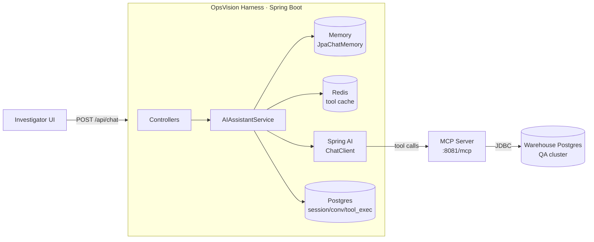
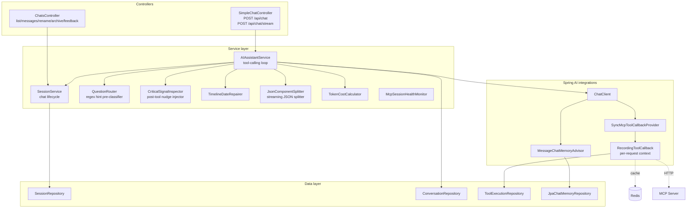
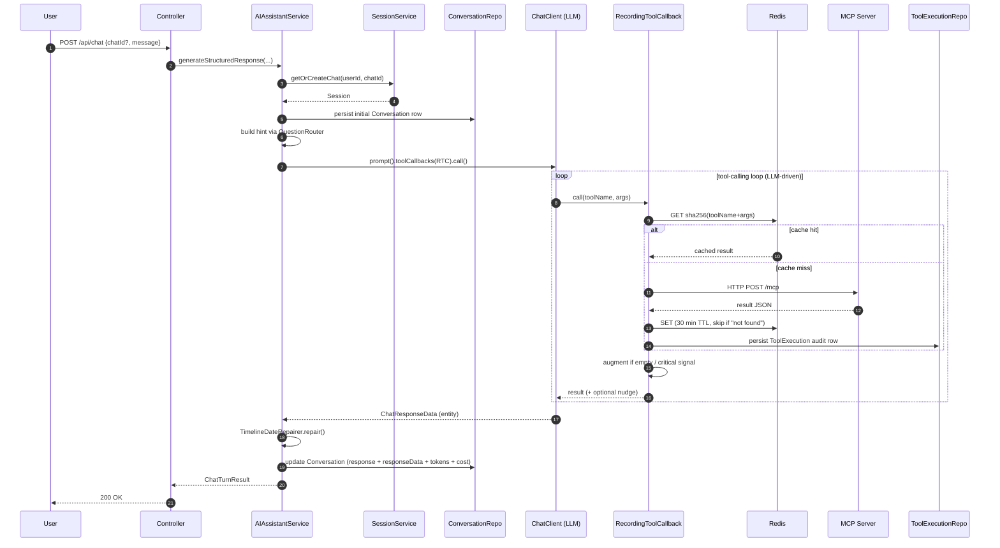
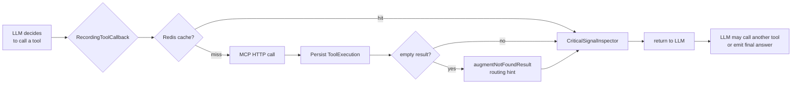
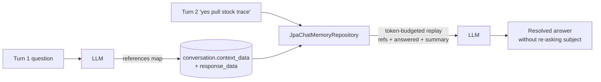
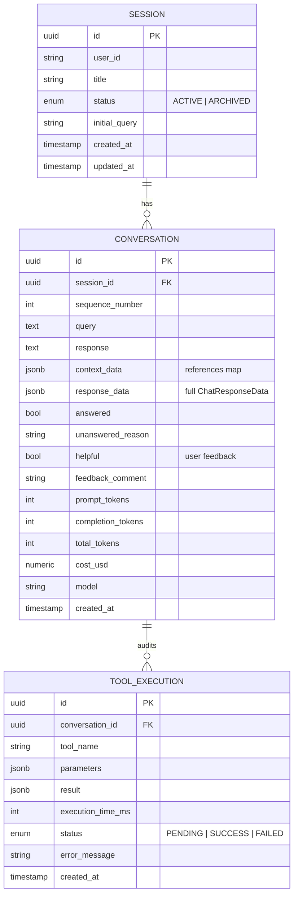

# OpsVision Harness — Design & Architecture

> Conversational investigation harness for warehouse operations. Operators ask questions; an LLM agent calls warehouse-system tools and replies with structured, multi-turn answers.

---

## 1. Problem

Warehouse incidents (a pick package stuck mid-flow, an order missing a stock trace, a picker queue blocked) are diagnosed today by hand: SREs SSH into databases, run shape-specific queries, and stitch results together. Time-to-answer is high; institutional knowledge is locked in a few engineers' heads.

**Goal:** let an investigator type a question in plain English and get back a grounded, auditable answer — with a timeline of facts, a results table, and identifiers the next turn can build on.

**Non-goals (for now):** automatic remediation, real-time alerting, generative summaries unbacked by a tool call.

---

## 2. Solution at a glance



The harness is one Spring Boot service. It does not own warehouse data — it brokers between an LLM and an MCP tool server that fronts the warehouse databases. Everything else (memory, cache, audit, routing) is harness-side glue around Spring AI's tool-calling loop.

---

## 3. Stack

| Layer            | Choice                                                   | Why                                                                  |
| ---------------- | -------------------------------------------------------- | -------------------------------------------------------------------- |
| Runtime          | Java 21, Spring Boot 4.0.6                               | Team standard; native tool-callback support in Spring AI             |
| LLM framework    | Spring AI 2.0.0-M5                                       | First-class MCP client + structured-output + memory advisor          |
| Default model    | `gpt-5.4-mini` (configurable via `OPENAI_MODEL`)         | Cheap, low-latency, strong tool-calling; gpt-5 family for cost floor |
| Tool transport   | MCP streamable-http → `localhost:8081/mcp`               | MCP server is a separate repo; handles all warehouse-DB access       |
| Persistence      | Postgres 15+ (Flyway-migrated)                           | Sessions, conversations, tool-execution audit                        |
| Cache / sessions | Redis 7 (Lettuce)                                        | Tool-result cache (30 min TTL)                                       |
| Reliability      | Resilience4j circuit breaker on MCP                      | 70 %/15 s default; isolates harness from MCP outages                 |

> **Note:** README mentions Gemini — that's stale. The project moved to OpenAI's gpt-5 family. `max-completion-tokens` is the only token-limit field that works; `max-tokens` is rejected by the gpt-5 family.

---

## 4. Component view



**Single chat orchestrator.** Both `/api/chat` and `/api/chat/stream` route into `AIAssistantService`. Don't add a second chat service — consolidate here.

| Component                  | Role                                                                                              |
| -------------------------- | ------------------------------------------------------------------------------------------------- |
| `AIAssistantService`       | Drives Spring AI's tool-calling loop, shapes structured output, persists turn                     |
| `SessionService`           | Resolves chat by id, enforces ownership, manages active/archived state                            |
| `QuestionRouter`           | Pre-classifies user message by regex (PP code, picker code, order_item_id shape …) → routing hint |
| `CriticalSignalInspector`  | Post-tool inspector — appends "chain required" nudge when a tool result matches a known pattern   |
| `RecordingToolCallback`    | Wraps each MCP tool: cache lookup, audit row, not-found augmentation, SSE emission                |
| `JpaChatMemoryRepository`  | Replays prior turns from `conversation` table under a token budget for memory advisor             |
| `TimelineDateRepairer`     | Reconciles LLM-emitted timeline dates against ISO timestamps in description fields                |
| `JsonComponentSplitter`    | Splits accumulating SSE JSON so UI can render `textResponse` before `table` arrives               |
| `McpSessionHealthMonitor`  | Tracks MCP transport health; surfaces circuit-breaker state                                       |
| `TokenCostCalculator`      | Per-model pricing table → cost per turn (written to `conversation.cost_usd`)                      |

---

## 5. Request flow



**Streaming variant** (`/api/chat/stream`) follows the same pipeline on a `boundedElastic` worker and emits SSE events: `chatId` → `tool_call_start/end` (per MCP call) → `assistant_token` (per chunk) → `final` (parsed `ChatResponseData`).

---

## 6. The tool-calling loop in detail

The LLM is in charge of *when* and *which* tools to call. The harness controls *how* each call is mediated.



Three correctness levers live here:

1. **Cache** — keyed by `sha256(toolName + JSON args)`, 30 min TTL. **Skips not-found results** so a wrong-tool call doesn't poison a turn that recovers with the right one.
2. **Loop 1 nudge (`augmentNotFoundResult`)** — when MCP returns an empty entity, the harness appends a generic routing hint so the LLM can self-correct in-loop (e.g., retry with `getPickPackage` after `getPickList` returned empty for a PP-shaped input). Generic across all tools.
3. **Critical-signal inspector** — when a successful tool result matches a configured rule (e.g., `diagnosePickPackage` returns 0 allocations + no terminal signals), append a "chain required" nudge naming the next tool to call. Rules are config-driven (`critical-signals.rules` in `application.yml`).

> **Per-request context (conversationId, invokedTools, userId, optional SSE sink) is constructor-injected into `RecordingToolCallback` — not via ThreadLocals.** ThreadLocals don't propagate across Reactor schedulers; that previously broke streaming-path audit persistence and log MDC.

---

## 7. Memory & multi-turn continuity



Two complementary mechanisms:

- **`MessageChatMemoryAdvisor`** keyed on `session.id`. Spring AI replays alternating user/assistant messages on each turn; memory budget is `max-messages: 20`, `max-tokens: 4000`. Right now the repository implementation runs in-process — restart wipes memory. Persisting via `JpaChatMemoryRepository` is staged but not yet wired in.
- **`ChatResponseData.references`** — a flat map (`pickPackageCode`, `stockTraceIds`, `pickListId`, …) that the LLM populates each turn. Carried into the next turn through memory replay so follow-ups like "pull the stock trace" resolve the implicit subject without fabrication.

---

## 8. Response shape — `ChatResponseData`

Returned to the UI and persisted to `conversation.response_data` (JSONB).

```json
{
  "textResponse": {
    "summary": "PP is waiting for a free picker.",
    "bullets": [
      "All 479 trained pickers are busy or offline",
      "Will move when a picker is freed",
      "Re-check in 30 minutes"
    ]
  },
  "timelines": {
    "data": [
      { "title": "PP created",      "description": "PK/MAR-01/V-2026/223506 created at 2026-05-07T08:30:21Z", "date": 1714993821296 },
      { "title": "Picker assigned", "description": "Assigned PIC-0000000818 at 2026-05-07T08:45:15Z",          "date": 1714994715123 }
    ]
  },
  "table": {
    "headers": ["Status", "Zone", "Eligible Pickers", "Available"],
    "rows":    [["PARTIAL_PACKAGE", "AT_WZ_GF_46001", "479", "0"]]
  },
  "references": {
    "pickPackageCode": "PK/MAR-01/V-2026/223506",
    "pickListId":      106641,
    "stockTraceIds":   ["474f98bd-7a6e-4c90-98da-f084cc073d9f"],
    "siteCode":        "MAR-01"
  },
  "answered": true,
  "unansweredReason": null
}
```

| Field             | Audience                         | Tone                                    |
| ----------------- | -------------------------------- | --------------------------------------- |
| `textResponse`    | end-user investigator            | operations-team plain English           |
| `table`           | dev / Slack-paste                | raw enum codes, untranslated            |
| `timelines`       | UI timeline component            | facts only; no inferences               |
| `references`      | next turn (machine-readable)     | flat map of identifiers                 |
| `answered` / `unansweredReason` | self-grade telemetry | `false` flags structural gaps to triage |

---

## 9. Data model



Schema is locked by Flyway migrations V1–V5; `hibernate.ddl-auto=validate` (no auto-create — Flyway is authoritative).

---

## 10. Reliability & observability

**Reliability**

- **Circuit breaker on MCP** (Resilience4j): 70 % failure-rate threshold over 20-call window, 15 s open-state, half-open after recovery.
- **Tool-result cache** absorbs retry storms during MCP hiccups.
- **Cache poison protection** — empty/not-found results are never cached.
- **Graceful streaming errors** — `StreamEvent.error()` instead of HTTP 500.

**Observability**

- **MDC log tagging** — every chat-turn log line carries `[user=… conv=…]` via the `withMdc` helper. ThreadLocals don't propagate across Reactor schedulers, so the helper scopes MDC explicitly inside `doOn*` callbacks.
- **`tool_execution` audit** — every MCP call lands a row with parameters, result, latency, status, error.
- **Self-grade signal** — `answered=false` rows surface structural gaps for triage.
- **Token + cost** — per-turn tokens and dollar cost on every `conversation` row.
- **Metrics** — `mcp.cache` (hit/miss), `mcp.tool.latency` (p50/p95/p99 per tool).

---

## 11. Key design decisions

| Decision                                                      | Why                                                                                                                                          |
| ------------------------------------------------------------- | -------------------------------------------------------------------------------------------------------------------------------------------- |
| Single `AIAssistantService` for sync + streaming              | One source of truth for the loop; streaming is just an SSE sink injected into the same path                                                  |
| Per-request context via constructor injection (no ThreadLocals) | Reactor schedulers break ThreadLocals — visible failure mode was missing audit rows on the streaming path                                  |
| Wrong-tool detection lives **harness-side**, not MCP-side     | MCP is intent-blind; correction signals (Loop 1 nudge, critical-signal inspector) belong where intent is known                               |
| Structured output via `entity(ChatResponseData.class)`        | Lets us treat the response as a typed object, repair timelines, and persist a JSONB blob — no regex over LLM prose                          |
| Cache skips not-found results                                 | A wrong-tool miss must not poison the turn that retries with the right tool                                                                  |
| Eval harness deferred                                         | Pre-built eval cases over-fit to imagination, not real failure modes; wait until production traffic seeds the failure set                    |
| In-process memory (for now)                                   | Pragmatic during pre-prod; `JpaChatMemoryRepository` is the planned upgrade once we decide what shape "long-lived chat memory" should take   |

---

## 12. Status & roadmap

**Shipped on `feature/tech_fixes`**

- Per-session memory advisor + tool-result cache
- `tool_execution` audit table
- Structured output via `ChatResponseData`
- SSE streaming endpoint
- MDC-tagged structured logs
- Loop 1 routing-hint nudge on empty MCP results
- `RecordingToolCallback` with constructor-injected per-request context

**Parked (intentionally)**

- Full eval harness (waiting for production failure modes)
- `JpaChatMemoryRepository` (durable conversation memory across restarts)
- Plan-then-execute split (single-stage tool calling is fine for now)
- RAG over runbooks
- JSON-encoded production logs

**Known gaps**

- `Conversation.context_data` JSONB column is never written. Either wire `references` into it per turn or drop the column.
- `app.session.max-active-per-user=5` config doesn't match `SessionService` returning exactly one active session. Reconcile config with reality.
- Memory is in-process — restart loses chat history.

---

## 13. Operational notes

- **VPN required** — MCP server reaches `central-postgres13-01.qa2-sg.cld`. Off-VPN, every tool call fails with `Could not open JDBC Connection for transaction`.
- **MCP server is a separate repo** at `/Users/jimmy.nongmaithem/work/scps/opsvision-mcp-server`, runs on `:8081`, owns its own DB credentials.
- **Bring up order:** Postgres + Redis (docker-compose) → MCP server (`:8081`) → harness (`mvn spring-boot:run`, `:8080`).
- **Verification baseline:** `~/Downloads/WCS phantom-close investigation — 2026-05-04.pdf` is the source of truth — 8 single-turn questions plus a 3-turn flow (224143 → reconcile → stock trace). Latest baseline: 7/8 strong, multi-turn working, Q6 partial closed via Loop 1 nudge.

---
